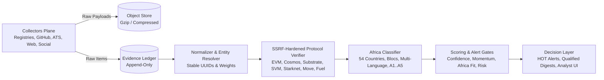

# Ashinity: Early Chain Discovery & Africa Expansion Intelligence Engine

> Production-ready, evidence-first intelligence pipeline for discovering public blockchains (EVM & non-EVM L1/L2/L3/appchains) before or shortly after mainnet, classifying Africa expansion intent vs. compatibility, and generating evidence-backed alerts for human analysts.

---

## 1. System Architecture

The engine is architected as an append-only evidence spine where decisions, scores, and analyst workflows remain completely traceable to immutable raw observations:



---

## 2. Key Features

- **Evidence-First Append-Only Ledger**: Decisions derive from timestamped raw evidence with SHA-256 integrity hashes.
- **SSRF-Hardened Read-Only Verifiers**: Pre-connect DNS resolution, blocking RFC1918, link-local, AWS/GCP metadata (`169.254.169.254`), and reserved ranges with 60–180s liveness rechecks.
- **Multi-Protocol Adapters**: Out-of-the-box support for EVM (`eth_chainId`, `eth_blockNumber`, genesis block 0), Cosmos/CometBFT (`/status`, `/genesis`), Substrate (`system_chain`, `chain_getBlockHash(0)`), SVM (`getGenesisHash`, `getSlot`), Starknet (`starknet_chainId`), Move (Aptos / Sui), and FuelVM.
- **Africa Intent & Market-Fit Engine**: Complete 54-country database, regional/economic blocs (AfCFTA, ECOWAS, EAC, SADC), priority hubs (Lagos, Nairobi, Accra, Cairo, etc.), local payment rails (NGN, KES, M-Pesa, MoMo), multi-language term packs (EN, FR, PT, AR, SW), and a 6-component feature vector strictly separating explicit intent (A1/A2) from inferred compatibility (A3).
- **Explainable Scoring ($C / M / A / R$)**:
  - $\text{Radar Score} = 0.40M + 0.35C + 0.25A$
  - $\text{Outreach Score} = 0.45C + 0.35A + 0.20M - 0.30R$
  - Outreach Gate qualification and state transitions (`HOT`, `QUALIFIED`, `RADAR`, `STALE`, `REJECT`).
- **Cadence & Scheduler**: Precise UTC cron jobs aligned with Africa/Lagos (WAT, UTC+1) display (every 10m for registry PRs, 15m for JSON, 30m for GitHub, 15m for RSS, 6h for ATS, 07:30 & 18:00 WAT digests).
- **Analyst Web UI**: Premium dark-mode glassmorphic dashboard with live queue feeds, interactive Evidence Card modal, real-time RPC verifier console, and source kill switches.
- **Compliance & Privacy**: NDPA GAID 2025, GDPR, and CAN-SPAM compliant suppression hash engine and 90-day contact retention review.

---

## 3. Quickstart

### Installation
```bash
# 1. Clone repository & create virtual environment
python3 -m venv .venv
source .venv/bin/activate

# 2. Install dependencies
pip install -r requirements.txt

# 3. Configure environment variables
cp .env.example .env

# 4. Seed initial candidate dataset
python3 scripts/seed_demo_data.py

# 5. Run development server
uvicorn src.api.main:app --host 0.0.0.0 --port 8000 --reload
```

### Access Points
- **Analyst Web UI**: `http://localhost:8000`
- **Interactive OpenAPI Documentation**: `http://localhost:8000/docs`
- **Health Check**: `http://localhost:8000/health`

---

## 4. Running Tests

Execute the complete test suite verifying all 16 acceptance test criteria from Section 25, SSRF penetration controls, protocol adapters, Africa lexicons, and the temporal backtesting engine:

```bash
source .venv/bin/activate
pytest -v
```

---

## 5. Docker Deployment

```bash
docker compose up -d --build
```

---

## 6. Implementation Checklist (Section 29)

- [x] Append-only evidence schema and projections created.
- [x] Source registry, cursor/ETag handling, per-source budget, and kill switches implemented.
- [x] Seven priority registry collectors functional (`ethereum-lists`, `chainid.network`, OP Superchain, Cosmos, Blockscout, Hyperlane, Axelar, CAIP).
- [x] CAIP-2-aware network identity with genesis/incarnation storage.
- [x] EVM, CometBFT, Substrate, SVM, Starknet, Move, and Fuel read-only adapters with SSRF controls.
- [x] GitHub sliding-window query packs and official RSS/sitemap collection.
- [x] Africa geo/language/intent packs separating explicit intent (A1) from inferred fit (A3).
- [x] ATS collectors for confirmed organizations and opportunity extraction.
- [x] Entity-resolution weights, collision/reset behavior, and analyst merge/reject tools.
- [x] Scores ($C/M/A/R$), Radar/Outreach queues, hard gates, and explainability payloads.
- [x] Evidence cards, HOT alerts, and 07:30/18:00 WAT digests.
- [x] Source health, latency, precision, duplication, verifier, and funnel metrics.
- [x] Temporal backtest (50 positive + 150 negative fixtures) and acceptance/security tests passed.
- [x] Privacy/outreach policies, source register, retention, and 10 operational runbooks approved.
